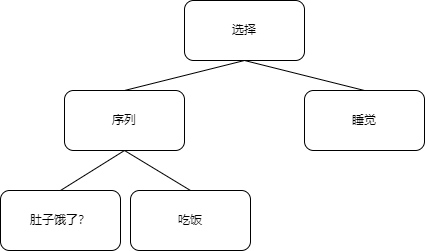

# 行为树
> namespace HamsterUtils.BehaviorTree

一个简单的行为树，节点结构完全由代码实现

## 使用示例

下面的代码演示如何实现一个这样的行为树:




```C#
// 决定现在饿不饿
bool isHungry = false;
BTSelector tree;

public override void _Ready()
{
// 根节点是一个选择器，他会一直执行子节点，直到有一个子节点返回了 BTState.YES
    tree = new BTSelector(

// 这是一个序列节点，他会顺次执行子节点，直到有一个子节点返回RUNNING或者NO，就会终止(RUNNING会执行完，但是不会执行RUNNING后面的节点)
        new BTSequence(
            new BTLeaf((node,delta)=>{
// 这个函数接收一个bool，如果是true则返回YES，false则返回false
                return BTUtils.GetState(isHungry);
            }),

// 这是一个叶节点，他可以执行自定义的功能，一般来说，执行成功则返回BTState.YES，不成功则返回BTState.NO，没有执行完则返回BTState.RUNNING
            new BTLeaf((node,delta)=>{
                if(isHungry){
                    GD.Print("好饿，吃饭！");

                    // 吃饭的代码

                    isHungry = false;   //现在不饿了
                    return BTState.YES;
                }else return BTState.NO;
            })
        ),
        
// node表示这个BTLeaf
//delta表示的是经过的时间，和_Process(float delta)里的delta意义相同(当然，一般我们就是把_Process里的值给他的)
        new BTLeaf((node,delta)=>{
            // 由于前一个叶节点已经检测过isHungry了，那么只要代码执行到这，就说明前一个节点返回了NO，即isHungry==false
            GD.Print("吃饱了，睡觉!");

            // 睡觉的代码

            return BTState.YES; //这是最后一个子节点，因为不会有下一个节点需要控制，且不是一个长时间的任务，所以返回除了RUNNING之外的都可以，这里用YES
        })
    );
}

// 在_Process里运行这个行为树，输入delta作为时间变化量
public override void _Process(float delta){
    tree.Run(delta);
}
```

## 示例
[示例文件](Example.cs)
